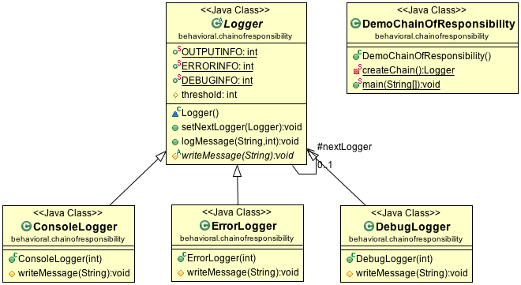

#Chain of Responsibility Pattern

The main idea of Chain of Responsibility Pattern is to build a chain of processing unit, each unit handle the request if threshold is satisfied. Since a chain is built, if one unit is not satisfied, the next unit will be tested, and so on. Each request will be processed along the chain.

##Class diagram

