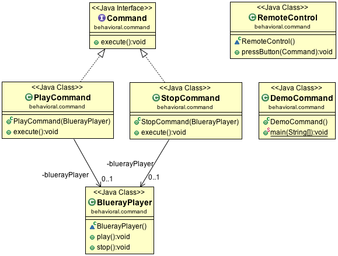

Command Design Pattern
======================

Command Design Pattern is used to encapsulate a request as an object and pass it to an invoker, wherein the invoker does not know how to service the request but it uses the encapsulated command to perform an action. Command Pattern has four parts: command, receiver, invoker and client.

- Command is an interface with execute method.
- A client creates an instance of a command implementation and associates it with a receiver.
- An invoker instructs the command to perform an action.
- A Command implementation’s instance creates a binding between the receiver and an action.
- Receiver is the object that knows the actual steps to perform the action.

