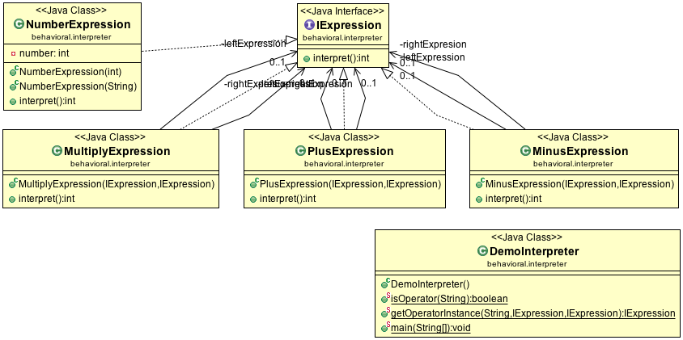

Interpreter Design Pattern
==========================

Interpreter Design Pattern gives the ability to define a language’s grammar with an interpreter, where in that interpreter uses that definition to interpret sentences of that language. The example uses the Reverse Polish Notation (Postfix) to explain this design pattern. Here the operator comes after the operand, so `1 2 +` would be equivalent to `1 + 2`. In the example the expression `4 3 2 - 1 + *` is used which equivalent is `(3 - 2 + 1) * 4`

