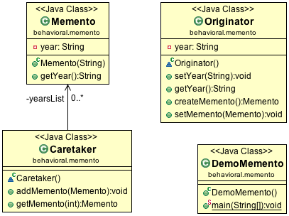

#Memento Design Pattern

Memento Design Pattern helps to restore an object’s state to it previous state. It is used to implement the undo operation. This is done by saving the current state of the object as it changes its state.

##Class diagram

