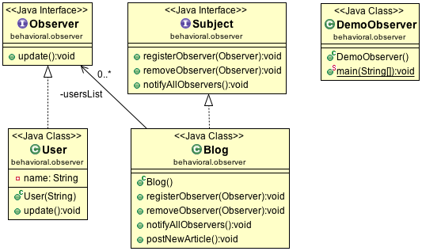

Observer Design Pattern
=======================

In Observer Design Pattern multiple observer objects register with a subject for change notification. When the state of subject changes, it notifies the observers. Objects that listen or watch for change are called observers and the object that is being watched for is called subject.

