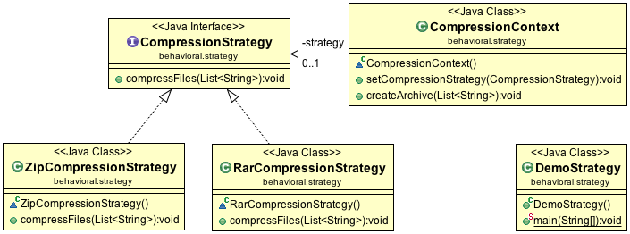

#Strategy Design Pattern

The Strategy Design Pattern consists of a number of related algorithms encapsulated in a driver class often named Context. A user or a client program typically selects the algorithm they want to use, although the Context class may also select the algorithm automatically. The intent of the Strategy Pattern is to make the algorithms easily interchangeable, and provide a means to choose the appropriate algorithm at a particular time.

##Class diagram

