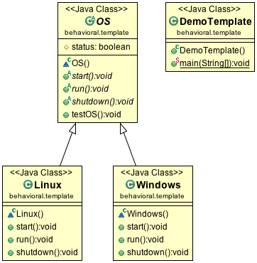

#Template Design Pattern

The Template Design Pattern defines the workflow for achieving a specific operation. It allows the subclasses to modify certain steps without changing the workflow’s structure.

##Class diagram

