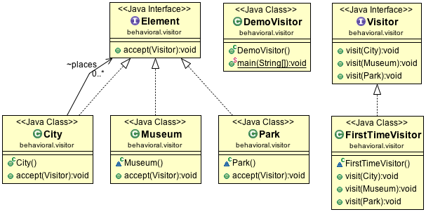

Visitor Design Pattern
======================

Visitor Pattern is a design pattern commonly used in the parser of a compiler, such as Eclipse JDT AST Parser. Basically, there are two interfaces, Visitor and Element.

