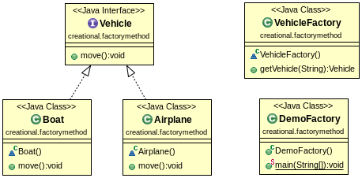

#Factory Method Pattern

A Factory Pattern is used for creating an object based on different parameters. The example is about creating vehicle in a factory. If we ask the factory for a boat, the factory will produce a boat; if we ask for an airplane, the factory will produce an airplane.

##Class diagram

