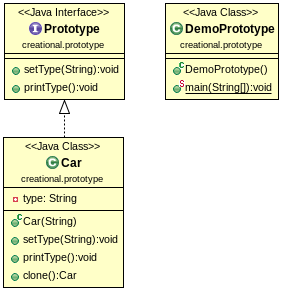

Prototype Design Pattern
========================

Prototype Pattern is used when very similar objects frequently are required. It clones objects and set the changed feature. This way less resources are consumed.

