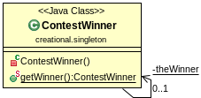

#Singleton Design Pattern

Singleton Pattern is used to control the number of objects created by preventing external instantiation and modification. A class must ensure that only single instance should be created and single object can be used by all other classes. To create the singleton class, we need:
- Private constructor: no other class can instantiate a new object.
- Private reference: no external modification.
- Public static method: the only place that can get an object.

There are two forms of Singleton Pattern:
- Early Instantiation: creation of instance at load time.
- Lazy Instantiation: creation of instance when required.

In the example a contest can have only one winner. So whenever we have to select a winner, just use ContestWinner to return one. getWinner() method will make sure there is always only one winner created.

##Class diagram

