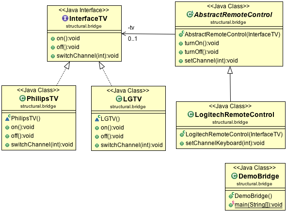

#Bridge Design Pattern

The Bridge Pattern is meant to “decouple an abstraction from its implementation so that the two can vary independently”. The Bridge uses encapsulation, aggregation, and can use inheritance to separate responsibilities into different classes.

##Class diagram

