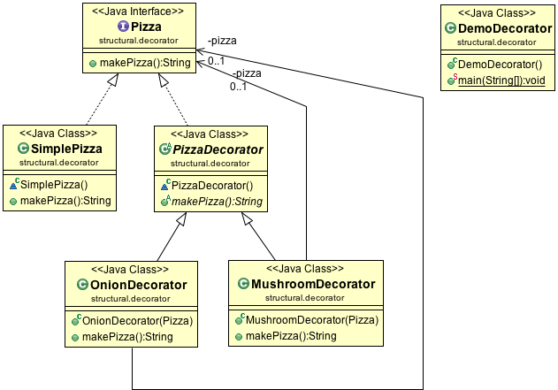

#Decorator Design Pattern

Decorator Pattern adds additional features to an existing object dynamically. It uses composition instead of inheritance to extend the functionality of an object at runtime.

##Class diagram

